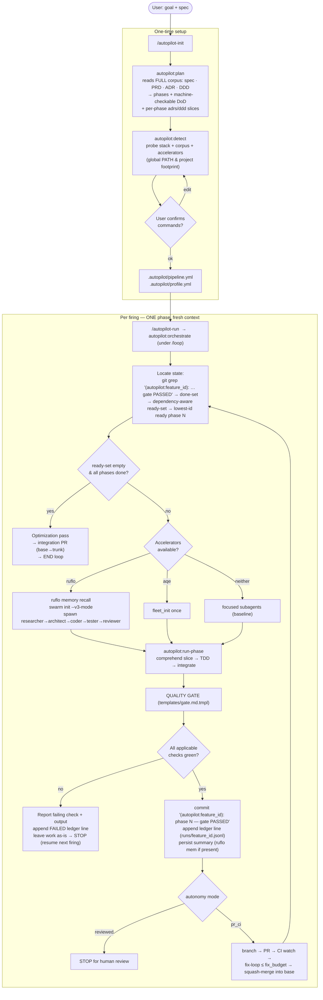
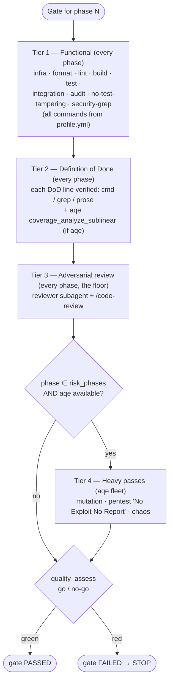
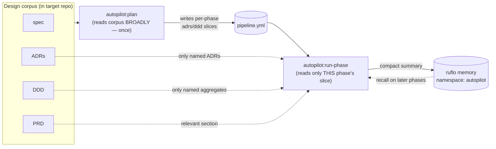
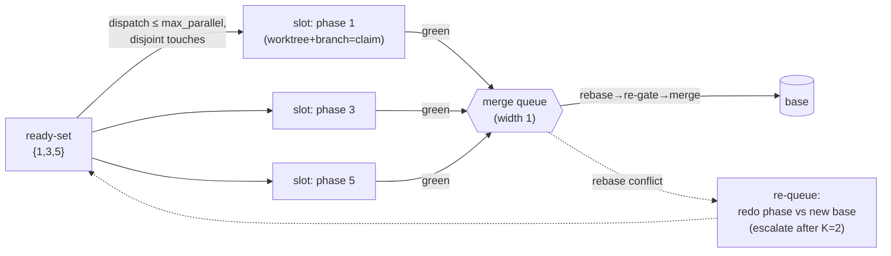

# Autopilot — workflow & effort, step by step

How a feature goes from spec to merged, and exactly where the optional power-ups plug in **only when
detected** — _execution_ accelerators (ruflo / agentic-qe (aqe)) during implement+gate, the _work-graph_
projection (beads) around sequencing, and _planning_ skills (superpowers / clarity / deep-research)
during `plan`. Everything works without them; when present, autopilot actively drives them. Multi-track
scope is sequenced by a **dependency-aware ready-set** computed from each phase's `depends_on:` — a
git-native work graph that needs no tool (see
[ADR-0001](adr/0001-dependency-aware-work-graph-beads-ruflo.md)).

## End-to-end flow



## The gate, expanded (where aqe layers in)



## Comprehension: who reads what (the memory contract)



## Artifacts & replay (what each run leaves behind)

Every run is reconstructable from the target repo alone — no conversation memory, and (except where
noted) no ruflo and no beads. Everything is scoped by `feature_id`, so running autopilot repeatedly in
one repo keeps each feature's state cleanly separate.

| Artifact                       | Where                                                                   | Role                                                                                                                                                                                                               |
| ------------------------------ | ----------------------------------------------------------------------- | ------------------------------------------------------------------------------------------------------------------------------------------------------------------------------------------------------------------ |
| `gate PASSED` markers          | git commits, `(autopilot:<feature_id>): phase N complete — gate PASSED` | **Authority** for "what phase is next" — re-derived by grep every firing                                                                                                                                           |
| Session ledger                 | `.autopilot/runs/<feature_id>.jsonl` (committed)                        | **Replayable history** — first line is the plan snapshot (`type:plan`), then one JSON line per firing (phase · verdict · skipped · ci_attempts · PR · accelerators · timestamp), pass or fail. Works with no ruflo |
| `pipeline.yml` / `profile.yml` | `.autopilot/` (committed)                                               | The plan + stack profile — editable, re-runnable                                                                                                                                                                   |
| Branches / PRs (pr_ci)         | GitHub: `autopilot/<feature_id>/phase-N`, the integration PR            | In-flight resume points                                                                                                                                                                                            |
| Phase summaries                | ruflo memory `autopilot` namespace — **only if ruflo present**          | Optional richer recall on later phases                                                                                                                                                                             |
| Work-graph projection          | beads (`.beads/`) — **only if beads present**                           | Optional queryable/visual view of the graph (`bd ready`, `bd dep tree`); synced one-way from markers, never the authority — the graph itself lives in `pipeline.yml depends_on`                                    |

The ledger is the human-readable companion to the markers: markers answer _where are we_, the ledger
answers _how did each phase get there_ — including FAILED attempts, which never leave a marker. To
audit or replay a run, read `.autopilot/runs/<feature_id>.jsonl`; `/autopilot-status` summarizes it.

## Effort summary

| Stage                 | Without accelerators (baseline)                    | With ruflo                            | With aqe                                            |
| --------------------- | -------------------------------------------------- | ------------------------------------- | --------------------------------------------------- |
| Plan                  | read corpus, score readiness, decompose, write DoD | + memory recall of prior decisions    | + `requirements_validate` scores/makes DoD testable |
| Detect                | probe stack/corpus, confirm                        | (records ruflo scope)                 | (records aqe scope)                                 |
| Implement             | TDD with focused subagents                         | hierarchical-mesh swarm, peer-to-peer | seed RED with `qe-test-architect`                   |
| Gate T1–T3            | commands + reviewer subagent + /code-review        | swarm reviewer                        | coverage_analyze_sublinear                          |
| Gate T4 (risk_phases) | — (relies on T3 floor)                             | —                                     | mutation · pentest · chaos                          |
| Advance               | git marker (+ optional PR/CI)                      | persist summary to memory             | persist QE signals to memory                        |

**Planning skills (Plan stage only).** When the spec scores thin, `plan` step 2 enriches on a degrade
ladder before decomposing: **best** — `deep-research` produces a **cited** brief (saved to
`.autopilot/research/<feature_id>.md`) and `clarity` turns it into numbered testable requirements;
**middle** — when those are absent but `ruflo` is present, its `researcher` + SPARC `specification`
agents and `hive-mind` consensus draft requirements (no citation discipline, so claims are flagged
unverified); **floor** — `superpowers:brainstorming` or an inline rubric. The user confirms before
phases are shaped. Like the execution accelerators, these change how sharp the spec is — never whether a
phase can pass.

The invariant across every column: **a red gate never advances, and a missing accelerator never fails
the gate** — accelerators change speed and depth, not the pass/fail meaning.

## Parallel execution (opt-in, `pr_ci` only)

By default autopilot runs **one phase per firing**. On a wide multi-track feature the ready-set often
holds several independent units at once (e.g. `{1,3,5}` across three bounded contexts). Setting
`max_parallel: N` (> 1) in `pipeline.yml` lets `pr_ci` mode implement up to N of them concurrently —
**without** risking merge hell, because it separates the two things:

- **Implementation is parallel.** Each ready+admissible unit runs in its **own git worktree** on its own
  phase branch. **Pushing that branch _is_ the claim** — the push is atomic, so two drivers never grab
  the same unit, and the in-flight set is just `git ls-remote` (no memory, no beads needed).
- **Merging is serial.** Every green PR lands through a **width-1 merge queue**: rebase onto the current
  `base` → re-run CI → merge, one at a time. The unit that merges is always re-tested against the base
  it actually lands on, so "green alone, red together" is caught **before** it merges.



Two guards keep it safe: **touch-set admission** (declare a phase's `touches:` globs; overlapping units
run serially, not concurrently) and **conflict ⇒ re-queue, never hand-merge** (a rebase conflict drops
the unit back to not-started to be re-implemented against the advanced base; after `K = 2` conflict-
requeues it escalates to a human). `reviewed` mode is **always serial**, and `max_parallel: 1` is
byte-for-byte the single-phase behavior — parallelism is strictly opt-in. Full design:
[ADR-0002](adr/0002-parallel-ready-units-merge-queue.md); the operational playbook:
`plugins/autopilot/skills/orchestrate/references/mode-pr-ci-parallel.md`.

## Discovered work — blockers & parking-lot

Mid-run an agent often finds work that wasn't planned. autopilot never silently drops it and never
silently folds it into the PR (that would creep the scope). Instead it records it — provenance-stamped,
split by kind — in a committed `.autopilot/discovered/<feature_id>.jsonl` (git is authority; beads mirrors
it as `discovered-from` edges). Full design: [ADR-0003](adr/0003-discovered-work-blockers-parking-lot.md).

- **Parking-lot** — an out-of-scope tangent (a latent bug, an unrelated N+1). Recorded passively; **never
  blocks**, never enters the active graph. A backlog a human triages later.
- **Blocker** — an in-scope prerequisite the phase can't satisfy (it can't reach a green gate because
  something it depends on doesn't exist). run-phase records it with a distinct **`BLOCKED`** verdict
  (not a gate failure — it consumes no `fix_budget`/`requeue_budget`) and **stops that unit**. In parallel
  mode only the blocked unit halts; siblings keep going. An **open blocker removes its phase from the
  ready-set**, so orchestrate never re-runs it in a loop; if everything left is blocked it stops with
  "⏸ awaiting human," never spins.

**Actioning a blocker uses the commands you already have — no new one.** Satisfying the dependency _is_
the unblock:

```text
/autopilot-status   → see open blockers (loud): id · blocks: N · provenance · → /autopilot-plan
/autopilot-plan     → fold it in (new phase + depends_on edge) · queue it (own pipeline) · or
                      dismiss (correct the DoD); appends an append-only status transition
/autopilot-run      → resumes: once the prerequisite is gate-PASSED (or the DoD corrected), the
                      ready-set re-includes the phase automatically
```

`status` to see, `plan` to action, `run` to resume — the human makes the scope call, autopilot does the
mechanical resume.

## Running more than one pipeline over time

A repo isn't done after one feature. The lifecycle for coexisting pipelines is
**plan → queued → (run active pipeline) → promote → run → retire**:

- **Queued.** Scope a follow-up while one is in flight and `autopilot:plan` parks it at
  `.autopilot/queued/<feature_id>.pipeline.yml` (git-ignored, so it stays local) instead of overwriting
  the active plan. Adding a queued plan never disturbs the running one. An _unrelated_ requirement found
  mid-run belongs in its own queued pipeline, not as a bolted-on phase — one coherent concern per
  integration PR.
- **Promote.** When the active pipeline finishes (its `base → trunk` PR is open), `mv` the queued file
  into `.autopilot/pipeline.yml`, seed its ledger record 0, and commit. `orchestrate` ends the loop and
  points you at this step; it never auto-starts the next feature.
- **Retire.** Overwriting `pipeline.yml` with the next plan **is** retirement — no `archive/` dir,
  nothing lost. The retired plan survives in git history and as record 0 of its own
  `.autopilot/runs/<id>.jsonl`.
- **Base recovery (pr_ci).** If GitHub deletes `base` after the integration merge, the next firing
  recreates it from refreshed `trunk` and re-pushes it as a new branch (never a force-push), carrying
  local work — including queued plans — across with `git stash -u`/`pop`.

The exact, copy-pasteable, idempotent command sequences (promote, retire, retrofit a pre-0.7.0 ledger,
recreate a deleted base) live in [`lifecycle.md`](lifecycle.md).
