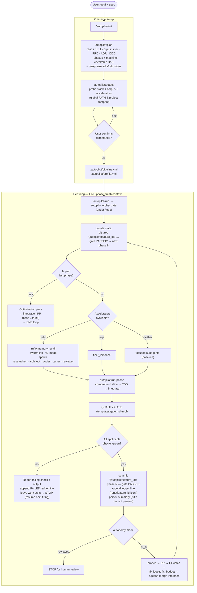
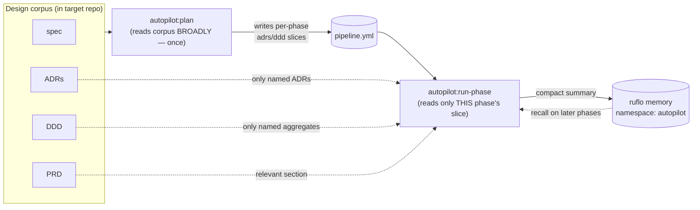

# Autopilot — workflow & effort, step by step

How a feature goes from spec to merged, and exactly where the optional power-ups plug in **only when
detected** — _execution_ accelerators (ruflo / agentic-qe (aqe)) during implement+gate, and _planning_
skills (superpowers / clarity / deep-research) during `plan`. Everything works without them; when
present, autopilot actively drives them.

## End-to-end flow

## The gate, expanded (where aqe layers in)

## Comprehension: who reads what (the memory contract)

## Artifacts & replay (what each run leaves behind)

Every run is reconstructable from the target repo alone — no conversation memory, and (except where
noted) no ruflo. Everything is scoped by `feature_id`, so running autopilot repeatedly in one repo keeps
each feature's state cleanly separate.

| Artifact                       | Where                                                                   | Role                                                                                                                                                                                                               |
| ------------------------------ | ----------------------------------------------------------------------- | ------------------------------------------------------------------------------------------------------------------------------------------------------------------------------------------------------------------ |
| `gate PASSED` markers          | git commits, `(autopilot:<feature_id>): phase N complete — gate PASSED` | **Authority** for "what phase is next" — re-derived by grep every firing                                                                                                                                           |
| Session ledger                 | `.autopilot/runs/<feature_id>.jsonl` (committed)                        | **Replayable history** — first line is the plan snapshot (`type:plan`), then one JSON line per firing (phase · verdict · skipped · ci_attempts · PR · accelerators · timestamp), pass or fail. Works with no ruflo |
| `pipeline.yml` / `profile.yml` | `.autopilot/` (committed)                                               | The plan + stack profile — editable, re-runnable                                                                                                                                                                   |
| Branches / PRs (pr_ci)         | GitHub: `autopilot/<feature_id>/phase-N`, the integration PR            | In-flight resume points                                                                                                                                                                                            |
| Phase summaries                | ruflo memory `autopilot` namespace — **only if ruflo present**          | Optional richer recall on later phases                                                                                                                                                                             |

The ledger is the human-readable companion to the markers: markers answer _where are we_, the ledger
answers _how did each phase get there_ — including FAILED attempts, which never leave a marker. To
audit or replay a run, read `.autopilot/runs/<feature_id>.jsonl`; `/autopilot-status` summarizes it.

## Effort summary

| Stage                 | Without accelerators (baseline)                    | With ruflo                            | With aqe                                            |
| --------------------- | -------------------------------------------------- | ------------------------------------- | --------------------------------------------------- |
| Plan                  | read corpus, score readiness, decompose, write DoD | + memory recall of prior decisions    | + `requirements_validate` scores/makes DoD testable |
| Detect                | probe stack/corpus, confirm                        | (records ruflo scope)                 | (records aqe scope)                                 |
| Implement             | TDD with focused subagents                         | hierarchical-mesh swarm, peer-to-peer | seed RED with `qe-test-architect`                   |
| Gate T1–T3            | commands + reviewer subagent + /code-review        | swarm reviewer                        | coverage_analyze_sublinear                          |
| Gate T4 (risk_phases) | — (relies on T3 floor)                             | —                                     | mutation · pentest · chaos                          |
| Advance               | git marker (+ optional PR/CI)                      | persist summary to memory             | persist QE signals to memory                        |

**Planning skills (Plan stage only).** When the spec scores thin, `plan` step 2 enriches on a degrade
ladder before decomposing: **best** — `deep-research` produces a **cited** brief (saved to
`.autopilot/research/<feature_id>.md`) and `clarity` turns it into numbered testable requirements;
**middle** — when those are absent but `ruflo` is present, its `researcher` + SPARC `specification`
agents and `hive-mind` consensus draft requirements (no citation discipline, so claims are flagged
unverified); **floor** — `superpowers:brainstorming` or an inline rubric. The user confirms before
phases are shaped. Like the execution accelerators, these change how sharp the spec is — never whether a
phase can pass.

The invariant across every column: **a red gate never advances, and a missing accelerator never fails
the gate** — accelerators change speed and depth, not the pass/fail meaning.
