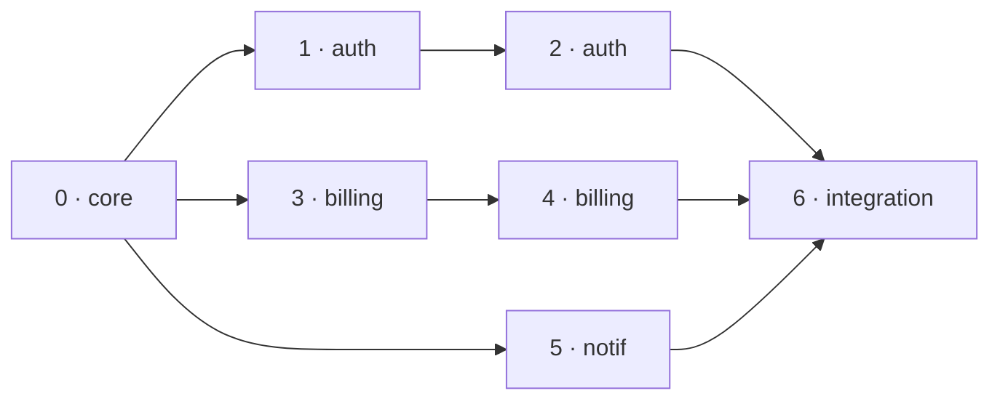

# Worked example — a multi-track work graph

A concrete demonstration of the dependency-aware ready-set from
[ADR-0001](../adr/0001-dependency-aware-work-graph-beads-ruflo.md). It shows the three properties the
design promises on a realistic feature that spans several bounded contexts — and how each is machine-
checked by `scripts/verify-ready-set.mjs` (run `pnpm run proof`, also part of `pnpm run check`).

## The feature

A feature with a shared **core**, three independent **tracks** (auth, billing, notifications), and a
final **integration** phase that depends on all three. The relevant slice of `pipeline.yml`:

```yaml
phases:
  - { id: 0, track: core, depends_on: [] } # shared foundation
  - { id: 1, track: auth, depends_on: [0] }
  - { id: 2, track: auth, depends_on: [1] }
  - { id: 3, track: billing, depends_on: [0] }
  - { id: 4, track: billing, depends_on: [3] }
  - { id: 5, track: notif, depends_on: [0] }
  - { id: 6, track: core, depends_on: [2, 4, 5] } # integration
```



## The ready-set walk

Each firing recomputes from git markers alone — `ready(P) ≡ P not PASSED ∧ every depends_on(P) PASSED`,
then **select the lowest-id ready phase**. No conversation memory; the done-set _is_ the state.

| Firing | Done-set (from markers) | Ready-set       | Selected | Note                                            |
| ------ | ----------------------- | --------------- | -------- | ----------------------------------------------- |
| 1      | {}                      | **{0}**         | 0        | only the foundation is unblocked                |
| 2      | {0}                     | **{1, 3, 5}**   | 1        | **three tracks unblock at once** (Proof A)      |
| 3      | {0,1}                   | {2, 3, 5}       | 2        |                                                 |
| 4      | {0,1,2}                 | {3, 5}          | 3        | auth track done; billing/notif still ready      |
| 5      | {0,1,2,3}               | {4, 5}          | 4        |                                                 |
| 6      | {0,1,2,3,4}             | {5}             | 5        |                                                 |
| 7      | {0,1,2,3,4,5}           | {6}             | 6        | integration unblocks once all tracks are done   |
| 8      | {0,1,2,3,4,5,6}         | {} + all PASSED | —        | ready-set empty & all done → optimization → END |

The parallelism is **surfaced** (firing 2 shows three ready units); v1 still runs **one phase per
firing**, picking the lowest id. True concurrent execution is a deferred follow-on (ADR-0001).

## The three proofs (all machine-checked)

- **A — Parallelizable ready units.** After phase 0, the ready-set is `{1, 3, 5}` — work in one track is
  never falsely queued behind an unrelated track.
- **B — Resumability.** The next phase is a pure function of the done-set. Resume mid-run from markers
  `{0,1,3}` and the pick is deterministically `2` — no matter how the run got there, or how many
  contexts ago. This is why a run survives crashes, weeks of wall-clock, and context resets.
- **C — Identical when flat (and when accelerators are absent).** Give every phase an empty `depends_on`
  and the walk is `0,1,2,3,4,5` — exactly the old linear `N+1`. A legacy pipeline, or one on a vanilla
  repo with neither beads nor ruflo, behaves precisely as before. The graph only changes behavior when
  you declare edges.

A fourth check guards **deadlock**: a dependency cycle yields an empty ready-set with work remaining,
which `orchestrate` reports instead of spinning.

## Where beads fits (optional)

With `bd` present, `plan` mirrors this graph as epics (tracks) → issues (phases) → tasks (DoD), and
`bd ready` returns the same set as the table above — a queryable/visual view. It is a **projection**:
delete beads and the walk is unchanged, because the graph lives in `pipeline.yml` and the state lives in
git markers.
